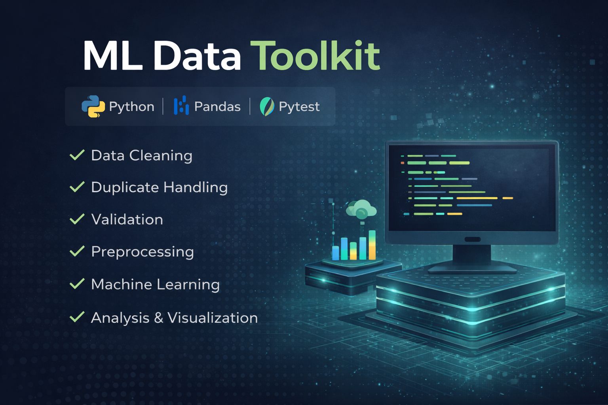

# ML Data Toolkit

  

Reusable Python toolkit for data preprocessing, analysis, and machine learning workflows.

## 🚧 Project Status

This project is currently under active development.

## ✅ Current Implementation

### data_toolkit

- Column name normalization and validation function implemented 
- Duplicate handling and reporting function implemented

### testing

- Test suite migrated to pytest (clean_columns, handle_duplicates)

## 🔜 Next Steps

- ## Next Steps
- Add usage examples for `clean_columns` and `handle_duplicates`
- Add missing value handling function

## 📦 Planned Modules

The following modules represent current ideas and may evolve over time.

### data_toolkit

Tools for data loading, cleaning, preprocessing, and exploratory analysis.

### ml_toolkit (planned)

Tools for training, evaluating, and managing machine learning models.

### visualization_toolkit (planned)

Tools for data visualization and reporting.

### sql_toolkit (planned)

Tools for integrating SQL workflows with Python.

## 🎯 Goal

The goal of this project is to build a reusable and modular toolkit
that accelerates future data science and machine learning projects.

This toolkit will be used across multiple portfolio projects.

## 📌 Author

Michał Ryzio
